# Proposal: Virtual Gamepad Control for Web Platform Tests

## Summary

Add a `test_driver.gamepad` API that lets automated Web Platform Tests create,
update, and remove virtual Gamepad API devices. The API is a test-only control
surface: it does not add web-exposed Gamepad API behavior.

The proposed initial WebKit implementation uses classic WebDriver vendor
commands. It does **not** require WebDriver BiDi.

> Status: the WebKit and Chromium gamepad endpoints in this document are
> proposals. Neither driver currently exposes a Classic WebDriver command for
> creating or controlling virtual gamepads.

## Problem

Most Gamepad API behavior can only be tested manually because the test has no
way to connect a gamepad or generate axis and button input. Existing browser
test infrastructure commonly has a mock-gamepad implementation, but it is
usually exposed through engine-specific test APIs rather than through WPT's
`test_driver` abstraction.

This prevents portable, automated WPT coverage for gamepad connection,
disconnection, input values, timestamps, visibility, user activation, and
haptics.

## Current WPT gamepad coverage

This snapshot is from the `gamepad/` directory in [Web Platform Tests (WPT)](https://github.com/web-platform-tests/wpt) 
on 2026-08-08. It counts source files, not individual `testharness.js` assertions.

| Area | Current status |
| --- | --- |
| Gamepad testdriver support | No `test_driver` or `testdriver` use was found in `gamepad/`. |
| Automated coverage | The directory has automated IDL-harness, permissions-policy, and not-fully-active-document tests. |
| Manual coverage | Seven files require a physical gamepad or manual interaction: connection events, polling, timestamps, IDL harness, dual rumble, trigger rumble, and tentative gamepad user activation. |
| Controlled device state | No upstream WPT helper creates a virtual gamepad or sets axis/button values. |
| Consequence | Core input and connection behavior remains either manual or covered only by browser-specific test suites. |

The manual files are `events-manual.html`, `getgamepads-polling-manual.html`,
`timestamp-manual.html`, `idlharness-manual.html`,
`gamepad-dual-rumble-effect-manual.https.html`,
`gamepad-trigger-rumble-effect-manual.https.html`, and
`gamepad-grants-user-activation-manual.tentative.html`.

The proposed API would make it possible to convert appropriate manual tests to
automated WPTs and to add deterministic tests for input state, event ordering,
visibility, timestamps, and haptic capability.

## Goals

- Allow a WPT to create a virtual gamepad with controlled static properties.
- Allow a WPT to update axes and buttons deterministically.
- Allow a WPT to disconnect the gamepad and clean it up.
- Keep tests portable: tests call `test_driver.gamepad`, not an engine-specific
  API.
- Permit implementations to use classic WebDriver, WebDriver BiDi, CDP, or an
  equivalent automation transport internally.

## Non-goals

- Defining a web-exposed API for creating gamepads.
- Replacing the Gamepad API specification's existing device and visibility
  rules.
- Requiring support for physical-device emulation beyond the Gamepad API data
  model.
- Requiring WebDriver BiDi.

## Proposed WPT API

```js
const handle = await test_driver.gamepad.connect({
  id: "WPT virtual gamepad",
  mapping: "standard",
  axes: 2,
  buttons: 2,
  dualRumble: false,
});

await test_driver.gamepad.update(handle, {
  axes: [0.5, -0.5],
  buttons: [1, 0],
});

await test_driver.gamepad.disconnect(handle);
```

### `connect(options)`

Creates a connected virtual gamepad and resolves with an opaque string handle.
The handle is only meaningful to `test_driver.gamepad` for the current test
session.

| Option | Type | Default | Meaning |
| --- | --- | --- | --- |
| `id` | string | `"WPT virtual gamepad"` | Gamepad `id` |
| `mapping` | string | `""` | Gamepad `mapping` |
| `axes` | unsigned integer | `0` | Number of axes |
| `buttons` | unsigned integer | `0` | Number of buttons |
| `dualRumble` | boolean | `false` | Whether dual-rumble is supported |

The promise resolves only after the Gamepad API can observe the newly connected
device. Tests that care about the `gamepadconnected` event should register the
listener before calling `connect()`.

### `update(handle, state)`

Updates selected axis and button values for an existing virtual gamepad.

| State member | Type | Meaning |
| --- | --- | --- |
| `axes` | array of numbers or `undefined` | Axis values, in `[-1, 1]` |
| `buttons` | array of numbers or `undefined` | Button values, in `[0, 1]` |

An `undefined` array entry leaves that input unchanged. An out-of-range index
or value rejects the promise with an appropriate testdriver error.

The promise resolves only after `navigator.getGamepads()` observes every
requested value. This acknowledgment is important because gamepad updates can
cross process boundaries asynchronously.

### `disconnect(handle)`

Disconnects the virtual device represented by `handle`. The promise resolves
after the browser has processed removal. The handle becomes invalid.

Calling an operation with an unknown, disconnected, or already-cleaned-up
handle rejects the promise.

## WPT testdriver plumbing

The public methods belong in WPT's `resources/testdriver.js`; they delegate to
`window.test_driver_internal.gamepad` in the same style as existing testdriver
features.

`wptrunner` provides that internal implementation from
`tools/wptrunner/wptrunner/testdriver-extra.js`. Each call emits an action:

| Public method | wptrunner action |
| --- | --- |
| `gamepad.connect(options)` | `gamepad.connect` |
| `gamepad.update(handle, state)` | `gamepad.update` |
| `gamepad.disconnect(handle)` | `gamepad.disconnect` |

`wptrunner` then dispatches those actions through `Gamepad*Action` classes and
a `GamepadProtocolPart`. This mirrors existing testdriver actions such as
virtual sensors and virtual authenticators.

## WebKit transport proposal

For the initial WebKit implementation, use three non-standard classic WebDriver
endpoints:

```text
POST /session/{sessionId}/webkit/gamepad/connect
POST /session/{sessionId}/webkit/gamepad/update
POST /session/{sessionId}/webkit/gamepad/disconnect
```

Example request bodies:

```json
{ "id": "WPT virtual gamepad", "mapping": "standard", "axes": 2, "buttons": 2, "dualRumble": false }
```

```json
{ "handle": "webkit-gamepad-0", "axes": [0.5, -0.5], "buttons": [1, 0] }
```

```json
{ "handle": "webkit-gamepad-0" }
```

The WebDriver responses use normal W3C WebDriver response envelopes. `connect`
returns `{ "handle": "…" }`; `update` and `disconnect` return `null`.

These are implementation-private endpoints. WPT tests never make HTTP requests
to them directly; the WebKit `wptrunner` protocol part does.

## WebKit implementation boundaries

The classic WebDriver server is not the browser UI process. Therefore the
WebDriver endpoint must forward commands through WebKit Automation to the UI
process, which owns the gamepad provider.

| Layer | Responsibility |
| --- | --- |
| `Source/WebDriver/WebDriverService.*` | Register and validate vendor endpoints |
| `Source/WebDriver/Session.*` | Forward gamepad commands to the automation backend |
| `Source/WebKit/UIProcess/Automation/Automation.json` | Define test-only automation commands |
| `WebAutomationSession.*` | Track session handles and invoke the mock provider in the UI process |
| `MockGamepadProvider` | Create devices, update input, and dispatch normal gamepad activity |
| `UIGamepadProvider` / Web process | Propagate state through the production gamepad IPC path |

The automation session must install the mock provider before it creates a
virtual gamepad. It should own the opaque-handle-to-gamepad-index mapping.

On WebDriver session teardown, it must disconnect all virtual gamepads created
by that session and clear their state. This avoids test leakage into later
sessions.

## Chromium implementation proposal

Chromium already has two relevant, but separate, test facilities:

1. `content/web_test/renderer/GamepadController` exposes the renderer-only
   `window.gamepadController` test API used by Chromium's legacy Blink web
   tests. It can connect, disconnect, and mutate gamepad state, but it is not
   available to a normal ChromeDriver/WPT session and must not become the WPT
   transport.
2. `device::GamepadService` has a browser-process simulated-gamepad path. It
   owns `AddSimulatedGamepad`, `RemoveSimulatedGamepad`, axis/button input, and
   `SimulateInputFrame`, backed by `SimulatedGamepadDataFetcher`. Its opaque
   identifier is a `base::UnguessableToken`.

The second facility is the appropriate backend for Chromium because it uses
the normal browser Gamepad service rather than a renderer test binding.

### Chromium command flow

```text
test_driver.gamepad.*
  → wptrunner GamepadProtocolPart
  → ChromeDriver vendor command
  → Chrome browser/DevTools automation bridge
  → device::GamepadService
  → SimulatedGamepadDataFetcher
  → normal Gamepad IPC/shared-memory update to Blink
```

### Chromium implementation items

| Item | Proposed change |
| --- | --- |
| ChromeDriver endpoint | Add private commands for `connect`, `update`, and `disconnect` under `POST /session/{sessionId}/goog/gamepad/...` (or another ChromeDriver-approved vendor prefix). |
| ChromeDriver dispatch | Add command definitions and handlers in `chrome/test/chromedriver`, then forward them to a browser-side automation interface rather than injecting JavaScript. |
| Browser-side interface | Add a browser-only, automation-gated Mojo or DevTools command that owns a per-WebDriver-session map from an opaque handle to `base::UnguessableToken`. |
| Create | Translate the WPT options into `device::SimulatedGamepadParams`, then call `device::GamepadService::AddSimulatedGamepad`. |
| Update | Call `SimulateAxisInput` and `SimulateButtonInput` for the supplied entries, followed by exactly one `SimulateInputFrame` per `update()` call. |
| Disconnect | Call `RemoveSimulatedGamepad` and remove the session handle. |
| Teardown | Remove every token owned by the WebDriver session when it ends. |

### Chromium option mapping

| WPT option | Chromium backend |
| --- | --- |
| `id` | `SimulatedGamepadParams::name` |
| `mapping` | `SimulatedGamepadParams::mapping` |
| `axes` | Length of `SimulatedGamepadParams::axis_bounds` |
| `buttons` | Length of `SimulatedGamepadParams::button_bounds` and `button_types` |
| `dualRumble` | Add the dual-rumble effect type to `SimulatedGamepadParams::vibration` |
| axis update | `GamepadService::SimulateAxisInput` |
| button update | `GamepadService::SimulateButtonInput` |

The WPT API deliberately omits Chromium-specific features such as explicit
button `pressed`/`touched` overrides, touch surfaces, trigger rumble, and input
normalization. Those can be proposed later as optional extensions once there
are cross-browser use cases.

### Chromium status and open implementation gap

[Chromium's latest repository](https://source.chromium.org/chromium/chromium/src) on 2026-08-08 already contains the simulated backend and extensive
device-level unit coverage for simulated gamepads. Chromium's legacy Blink web
tests also exercise a separate `window.gamepadController` test API. However,
the inspected source has no ChromeDriver or DevTools automation command that
exposes the simulated-gamepad backend to an external WPT session. The proposed
ChromeDriver bridge fills that gap without making `window.gamepadController`
web-visible in WPT.

## Implementation diagrams

### WebKit

```mermaid
flowchart LR
    A[WPT: test_driver.gamepad] --> B[wptrunner action]
    B --> C[WebKit WPT protocol part]
    C --> D[WebKit WebDriver vendor endpoint]
    D --> E[WebDriver Session]
    E --> F[WebKit Automation command]
    F --> G[WebAutomationSession in UI process]
    G --> H[MockGamepadProvider]
    H --> I[UIGamepadProvider]
    I --> J[Web process Gamepad API]
    J --> K[navigator.getGamepads]
```



The `WebKit WebDriver vendor endpoint` box is new work. It would be registered
in `Source/WebDriver/WebDriverService.cpp`; it is not an available endpoint
today.

### Chromium

```mermaid
flowchart LR
    A[WPT: test_driver.gamepad] --> B[wptrunner action]
    B --> C[Chromium WPT protocol part]
    C --> D[ChromeDriver vendor endpoint]
    D --> E[ChromeDriver command handler]
    E --> F[New browser automation bridge]
    F --> G[device::GamepadService]
    G --> H[SimulatedGamepadDataFetcher]
    H --> I[Gamepad shared memory and IPC]
    I --> J[Blink Gamepad API]
    J --> K[navigator.getGamepads]
```



ChromeDriver already has a generic Classic-WebDriver command-routing mechanism
(`VendorPrefixedSessionCommandMapping` in
`chrome/test/chromedriver/server/http_handler.cc`). It does not currently have
a gamepad route, nor is there an inspected DevTools Protocol Gamepad domain
that reaches `GamepadService`.

## One-to-one implementation checklist

The first two rows are shared WPT work. Each later row has one corresponding
WebKit and Chromium task that implements the same behavior.

| Behavior / work item | Shared WPT work | WebKit task | Chromium task |
| --- | --- | --- | --- |
| 1. Public API | Add `test_driver.gamepad.connect/update/disconnect` and default unsupported stubs to `resources/testdriver.js`. | None beyond implementing the internal operation. | None beyond implementing the internal operation. |
| 2. Testdriver action | Add internal methods to `testdriver-extra.js`. | Add a WebKit `GamepadProtocolPart` that handles `gamepad.*`. | Add a Chromium `GamepadProtocolPart` that handles the same `gamepad.*` actions. |
| 3. Create command | Define the `gamepad.connect` action payload and opaque handle result. | Add `POST /session/{id}/webkit/gamepad/connect` to `WebDriverService`; forward through `Session` and Automation. | Add a ChromeDriver vendor route, preferably with `VendorPrefixedSessionCommandMapping`, such as `POST /session/{id}/goog/gamepad/connect`. |
| 4. Browser backend for create | Validate the shared options. | `WebAutomationSession` installs `MockGamepadProvider`, calls `setMockGamepadDetails`, then `connectMockGamepad`. | Browser automation bridge converts options to `SimulatedGamepadParams`, then calls `GamepadService::AddSimulatedGamepad`. |
| 5. Update command | Define sparse axis/button state arrays. | Add `POST /session/{id}/webkit/gamepad/update`; forward through Automation. | Add `POST /session/{id}/goog/gamepad/update`; dispatch through ChromeDriver's browser bridge. |
| 6. Browser backend for update | Validate range, finiteness, handle, and indices. | Call `setMockGamepadAxisValue` / `setMockGamepadButtonValue`. | Call `SimulateAxisInput` / `SimulateButtonInput`, then one `SimulateInputFrame`. |
| 7. Completion guarantee | Make the promise resolve only when the browser has accepted the command; WPT may poll `navigator.getGamepads()` for observable state. | Preserve the existing UI-to-Web-process gamepad sync and acknowledge after the Automation command completes. | Acknowledge after `SimulateInputFrame` has been accepted; WPT polls for Blink-observable state if needed. |
| 8. Disconnect command | Define invalid-handle behavior. | Add `POST /session/{id}/webkit/gamepad/disconnect`; call `disconnectMockGamepad`. | Add `POST /session/{id}/goog/gamepad/disconnect`; call `GamepadService::RemoveSimulatedGamepad`. |
| 9. Session ownership | Define opaque handles as session-scoped. | Keep handle-to-index ownership in `WebAutomationSession`. | Keep handle-to-`UnguessableToken` ownership in the browser automation bridge. |
| 10. Cleanup | Specify cleanup on normal completion, failure, timeout, and session deletion. | Disconnect every owned mock gamepad when the WebDriver session ends. | Remove every owned simulated gamepad when the ChromeDriver session ends. |
| 11. Tests | Add portable WPT tests for connect, update, disconnect, and clean-session behavior. | Add WebKit WebDriver endpoint/Automation tests. | Add ChromeDriver command tests plus browser-process integration tests. |

## Classic WebDriver status

Classic WebDriver provides the transport and command-registration pattern, not
a standardized virtual-gamepad command. The existing reusable pieces are:

| Project | Existing Classic-WebDriver support | Missing gamepad-specific support |
| --- | --- | --- |
| WebKit | `WebDriverService` route table, `Session`, and the UI-process Automation command channel. | All three gamepad routes, the Session forwarding methods, Automation commands, and mock-provider session management. |
| Chromium | ChromeDriver's `CommandMapping` and `VendorPrefixedSessionCommandMapping`; ChromeDriver can forward browser operations over its existing DevTools connection. | Any gamepad route, a ChromeDriver command handler, and a browser/DevTools automation command that calls `device::GamepadService`. |

Accordingly, the proposed vendor endpoints are not new WebDriver-standard
interfaces. They are implementation-specific bridges required until a
cross-browser WebDriver or BiDi gamepad automation command is standardized.

## Why classic WebDriver first?

Classic WebDriver already drives WPT testdriver actions in `wptrunner`, and
WebKit already provides a classic WebDriver server. Adding vendor endpoints is
the smallest end-to-end change.

WebDriver BiDi remains a possible future transport. A BiDi `test.gamepad` or
`emulation.gamepad` domain could expose the same operations, especially if a
later design needs unsolicited gamepad-related automation events. It is not
necessary for create, update, and disconnect.

## Error and cleanup behavior

- Reject malformed option objects as `invalid argument`.
- Reject unknown handles as `no such gamepad` (or the closest established
  testdriver error category).
- Reject updates to a disconnected handle.
- Reject non-finite values and values outside the defined axis/button ranges.
- Always clean up all virtual devices at the end of a WebDriver session, even
  after a test timeout or browser-side test failure.

## Initial test coverage

The first automated test should verify:

1. `connect()` dispatches `gamepadconnected` and exposes the requested static
   properties.
2. `update()` exposes the requested axis and button values through
   `navigator.getGamepads()`.
3. `disconnect()` dispatches `gamepaddisconnected` and removes the device.
4. A subsequent test session begins without the previous session's gamepad.

## Questions for discussion

1. Is `test_driver.gamepad` the desired public namespace, or should this be a
   more general virtual-input namespace?
2. Should the initial API include haptic-effect result control, or should that
   be proposed separately?
3. Is numeric button input sufficient, with `pressed` and `touched` derived by
   the browser, or do tests need explicit `pressed`/`touched` state?
4. Should `connect()` resolve after connection is queued, or only after the
   device is observable from `navigator.getGamepads()`? This proposal chooses
   observability for deterministic tests.
5. Should the cross-browser transport be standardized as a WebDriver BiDi
   domain after implementations gain experience, while retaining the WPT API?
