# Proposal: Virtual Gamepad Control for Web Platform Tests

## Summary

Add a `test_driver.gamepad` API and Gamepad input sources for
`test_driver.Actions`. Together they let automated Web Platform Tests create,
drive, and remove virtual Gamepad API devices. The API is a test-only control
surface: it does not add web-exposed Gamepad API behavior.

The proposed initial implementation uses classic WebDriver vendor
commands. It does **not** require WebDriver BiDi.

> Status: the WebKit and Chromium gamepad endpoints in this document are
> proposals. Neither driver currently exposes a Classic WebDriver command for
> creating or controlling virtual gamepads.

## Problem

Most Gamepad API behavior can only be tested manually because the test has no
way to connect a gamepad or generate axis and button input. Existing browser
test infrastructure commonly has a mock-gamepad implementation, but it is
usually exposed through engine-specific test APIs rather than through WPT's
`test_driver` abstraction.

This prevents portable, automated WPT coverage for gamepad connection,
disconnection, input values, timestamps, visibility, user activation, and
haptics.

## Current WPT gamepad coverage

This snapshot is from the `gamepad/` directory in [Web Platform Tests (WPT)](https://github.com/web-platform-tests/wpt)
on 2026-08-08. It counts source files, not individual `testharness.js` assertions.

| Area | Current status |
| --- | --- |
| Gamepad testdriver support | No `test_driver` or `testdriver` use was found in `gamepad/`. |
| Automated coverage | The directory has automated IDL-harness, permissions-policy, and not-fully-active-document tests. |
| Manual coverage | Seven files require a physical gamepad or manual interaction: connection events, polling, timestamps, IDL harness, dual rumble, trigger rumble, and tentative gamepad user activation. |
| Controlled device state | No upstream WPT helper creates a virtual gamepad or sets axis/button values. |
| Consequence | Core input and connection behavior remains either manual or covered only by browser-specific test suites. |

The manual files are `events-manual.html`, `getgamepads-polling-manual.html`,
`timestamp-manual.html`, `idlharness-manual.html`,
`gamepad-dual-rumble-effect-manual.https.html`,
`gamepad-trigger-rumble-effect-manual.https.html`, and
`gamepad-grants-user-activation-manual.tentative.html`.

The proposed API would make it possible to convert appropriate manual tests to
automated WPTs and to add deterministic tests for input state, event ordering,
visibility, timestamps, and haptic capability.

## Goals

- Allow a WPT to create a virtual gamepad with controlled static properties
  and a browsing-context scope.
- Model gamepad input as an Actions input source, so it composes with other
  WebDriver input sources and has explicit tick ordering.
- Support axes, buttons (including independent `pressed`/`touched` sensors),
  touch surfaces, and advertised vibration effects in the device description.
- Allow a WPT to disconnect the gamepad and clean it up.
- Keep tests portable: tests call `test_driver.gamepad`, not an engine-specific
  API.
- Permit implementations to use classic WebDriver, WebDriver BiDi, CDP, or an
  equivalent automation transport internally.

## Non-goals

- Defining a web-exposed API for creating gamepads.
- Replacing the Gamepad API specification's existing device and visibility
  rules.
- Requiring observation or result control for vibration effects.
- Requiring WebDriver BiDi.

## Proposed WPT API

```js
const name = await test_driver.gamepad.connect({
  id: "WPT virtual gamepad",
  mapping: "standard",
  axes: [{minimum: -1, maximum: 1}, {minimum: -1, maximum: 1}],
  buttons: [
    {minimum: 0, maximum: 1},
    {minimum: 0, maximum: 1},
  ],
  surfaces: [],
  vibration: [],
});

await new test_driver.Actions()
  .addGamepad(name)
  .gamepadAxisInput(0, 0.5)
  .gamepadAxisInput(1, -0.5)
  .gamepadButtonInput(0, 1, {pressed: true, touched: true})
  .send();

await test_driver.gamepad.disconnect(name);
```

### `connect(options)`

Registers a simulated gamepad and resolves with an opaque string `name`. The
name is meaningful only to `test_driver.gamepad` and `test_driver.Actions` in
the current test session. Registration does not imply that the device is
already visible in `navigator.getGamepads()`: normal Gamepad visibility and
activation rules still apply. In particular, a test commonly sends an input
action before observing the device.

| Option | Type | Default | Meaning |
| --- | --- | --- | --- |
| `id` | string | `"WPT virtual gamepad"` | Gamepad `id` |
| `mapping` | `""`, `"standard"`, or `"xr-standard"` | `""` | Gamepad `mapping` |
| `context` | `WindowProxy` or browsing-context id | current context | Context to which the simulated device is scoped |
| `axes` | array of logical axis-bound records | `[]` | One record for each axis |
| `buttons` | array of logical button-bound records | `[]` | One record for each button; `type` is an optional experimental classification field. |
| `surfaces` | array of touch-surface records | `[]` | Supported touch surfaces |
| `vibration` | array of vibration-effect types | `[]` | Supported actuator effects |

The axis, button, surface, and vibration records use transport-neutral
dictionaries aligned with the browser's simulated-gamepad parameters (for
example, Chromium's `device::SimulatedGamepadParams`); browsers must not expose
their parameter object to test code. A button's required members describe its
logical bounds. Its `type` member is optional and is reserved for the proposed
`GamepadButton.type` API; it is not required for ordinary virtual-gamepad
tests.

### Gamepad Actions input source

`test_driver.Actions` gains a `gamepad` source type and the following builder
methods. As with keyboard, pointer, and wheel, `addGamepad(name, set = true)`
creates a source tied to the registered simulated gamepad, and `sourceName`
selects a non-default source when needed.

| Builder method | Meaning |
| --- | --- |
| `addGamepad(name, set = true)` | Add the registered gamepad as an Actions source. |
| `setGamepad(name)` | Select the default gamepad Actions source. |
| `gamepadAxisInput(axisIndex, value = 0, { sourceName = null } = {})` | Set a logical axis value. |
| `gamepadButtonInput(buttonIndex, value = 0, { sourceName = null, pressed = null, touched = null } = {})` | Set a logical button value and, when supplied, independent sensor states. |
| `gamepadTouchStart(touchId, x, y, { sourceName = null, surfaceId = 0 } = {})` | Start a contact on a touch surface. |
| `gamepadTouchMove(touchId, x, y, { sourceName = null } = {})` | Move an existing contact. |
| `gamepadTouchEnd(touchId, { sourceName = null } = {})` | End an existing contact. |

`touchId` is test-local identity used to associate actions; it need not equal a
touch identifier exposed by the Gamepad API. `value` is a logical, unnormalized
input value, validated against the bounds advertised by `connect()`.

When `pressed` or `touched` is `null` or omitted, the implementation derives
that state according to the simulated device's button model and value. When it
is supplied, the implementation must use the supplied boolean independently;
this supports devices with distinct pressure, touch, and press sensors.

`send()` dispatches gamepad inputs with the normal Actions tick semantics. A
driver accepts an action sequence once the input frame has been submitted to
its gamepad backend; a test that needs to assert renderer-visible state waits
for the relevant Gamepad API observation or event. This deliberately avoids
making `connect()` or each action wait for `navigator.getGamepads()`.

### `disconnect(name)`

Disconnects the registered device. The name becomes invalid. A test that cares
about `gamepaddisconnected` registers its listener before this call.

Calling an operation with an unknown, disconnected, or already-cleaned-up name
rejects the promise.

### `GamepadButton.type` coverage

When a user agent supports the proposed
[`GamepadButton.type` API](https://xingri.github.io/gamepad-button-type/), a
button record may additionally specify `type` as `"standard"`,
`"non-standard"`, or `"trackpad"`. The browser exposes that requested value
through the read-only `GamepadButton.type` attribute. This optional test hook
makes it possible to test the API without depending on a physical controller
or controller-specific button indices.

`GamepadButton.type` is not yet fully standardized. Its WPTs must therefore be
tentative and test the feature only when the user agent implements it. A
`connect()` request without a button `type` must remain supported everywhere
that implements the virtual-gamepad API. A request with button `type` is made
only after the feature guard below; it may reject as unsupported in a browser
without this experimental capability. Neither case must make unrelated
virtual-gamepad tests fail:

```js
const supportsButtonType =
  typeof GamepadButton !== "undefined" &&
  "type" in GamepadButton.prototype;

assert_implements_optional(
  supportsButtonType,
  "GamepadButton.type is implemented"
);

if (!supportsButtonType)
  return;
```

After the guard, the test may create a typed virtual gamepad and assert the
reported values. Once the API is standardized and the test is no longer
optional, the guard can be removed and the test promoted from tentative to
required coverage.

```js
const name = await test_driver.gamepad.connect({
  id: "WPT button-type gamepad",
  mapping: "standard",
  buttons: [
    {minimum: 0, maximum: 1, type: "standard"},
    {minimum: 0, maximum: 1, type: "non-standard"},
    {minimum: 0, maximum: 1, type: "trackpad"},
  ],
});

await new test_driver.Actions()
  .addGamepad(name)
  .gamepadButtonInput(2, 1, {pressed: true, touched: true})
  .send();

const gamepad = await waitForGamepadWithId("WPT button-type gamepad");
assert_equals(gamepad.buttons[0].type, "standard");
assert_equals(gamepad.buttons[1].type, "non-standard");
assert_equals(gamepad.buttons[2].type, "trackpad");
assert_true(gamepad.buttons[2].pressed);
assert_true(gamepad.buttons[2].touched);
```

The tentative WPT suite should include:

1. An IDL-harness test for `GamepadButton.type` and the three
   `GamepadButtonType` enum values.
2. A virtual-gamepad test that exposes all three types in one device and
   verifies that array order and values are preserved.
3. A state-independence test showing that an input action changes `value`,
   `pressed`, and `touched` without changing `type`.
4. A `mapping: "standard"` test confirming that a simulated trackpad button
   remains `"trackpad"` rather than being inferred from its array index.

These tests belong with the button-type specification change, but depend on
the virtual-gamepad facility proposed here for portable automated execution.

## WPT testdriver plumbing

The public lifecycle methods belong in WPT's `resources/testdriver.js`; they
delegate to `window.test_driver_internal.gamepad` in the same style as existing
testdriver features. `resources/testdriver-actions.js` gains the `gamepad`
source and its builder methods; serialization puts gamepad actions in the
ordinary action sequence sent by `test_driver.action_sequence()`.

`wptrunner` provides that internal implementation from
`tools/wptrunner/wptrunner/testdriver-extra.js`. Device lifecycle calls emit
their own actions, while input is carried by the Actions sequence:

| Public method | wptrunner action |
| --- | --- |
| `gamepad.connect(options)` | `gamepad.connect` |
| `gamepad.disconnect(name)` | `gamepad.disconnect` |
| `Actions.send()` with a gamepad source | extended WebDriver Actions payload |

`wptrunner` dispatches lifecycle calls through `Gamepad*Action` classes and a
`GamepadProtocolPart`. Its WebDriver Actions serializer recognizes the gamepad
source type. This mirrors both existing virtual-device features and the input
source model used for keyboard, pointer, and wheel.

## WebKit transport proposal

For the initial WebKit implementation, use two non-standard classic WebDriver
endpoints:

```text
POST /session/{sessionId}/webkit/gamepad/connect
POST /session/{sessionId}/webkit/gamepad/disconnect
```

Example request bodies:

```json
{ "id": "WPT virtual gamepad", "mapping": "standard", "axes": [{"minimum": -1, "maximum": 1}], "buttons": [], "surfaces": [], "vibration": [] }
```

```json
{ "name": "webkit-gamepad-0" }
```

The WebDriver responses use normal W3C WebDriver response envelopes. `connect`
returns `{ "name": "…" }`; `disconnect` returns `null`. Gamepad input is
sent in the session's normal WebDriver Actions command as a vendor-extended
`gamepad` source. This preserves mixed-source tick ordering without a separate
`update` endpoint.

These are implementation-private endpoints. WPT tests never make HTTP requests
to them directly; the WebKit `wptrunner` protocol part does.

## WebKit implementation boundaries

Based on [WebKit's latest repository](https://github.com/webKit/webkit) on 2026-08-08,
the classic WebDriver server is not the browser UI process. Therefore the
WebDriver endpoint must forward commands through WebKit Automation to the UI
process, which owns the gamepad provider.

| Layer | Responsibility |
| --- | --- |
| `Source/WebDriver/WebDriverService.*` | Register and validate vendor lifecycle endpoints |
| `Source/WebDriver/Session.*` | Forward lifecycle commands and extended Actions input to Automation |
| `Source/WebKit/UIProcess/Automation/Automation.json` | Define test-only automation commands |
| `WebAutomationSession.*` | Track session names and invoke the mock provider in the UI process |
| `MockGamepadProvider` | Create devices, consume Actions input, and dispatch normal gamepad activity |
| `UIGamepadProvider` / Web process | Propagate state through the production gamepad IPC path |

The automation session must install the mock provider before it creates a
virtual gamepad. It should own the opaque-name-to-gamepad-index mapping and
validate that each gamepad Actions source belongs to its session.

On WebDriver session teardown, it must disconnect all virtual gamepads created
by that session and clear their state. This avoids test leakage into later
sessions.

## Chromium implementation proposal

Chromium already has two relevant, but separate, test facilities:

1. `content/web_test/renderer/GamepadController` exposes the renderer-only
   `window.gamepadController` test API used by Chromium's legacy Blink web
   tests. It can connect, disconnect, and mutate gamepad state, but it is not
   available to a normal ChromeDriver/WPT session and must not become the WPT
   transport.
2. `device::GamepadService` has a browser-process simulated-gamepad path. It
  owns `AddSimulatedGamepad`, `RemoveSimulatedGamepad`, simulated input, and
  `SimulateInputFrame`, backed by `SimulatedGamepadDataFetcher`. Its opaque
   identifier is a `base::UnguessableToken`.

The second facility is the appropriate backend for Chromium because it uses
the normal browser Gamepad service rather than a renderer test binding.

### Chromium command flow

```text
test_driver.gamepad.connect/disconnect or Actions.send()
  → wptrunner GamepadProtocolPart / Actions serializer
  → ChromeDriver lifecycle command / extended Actions command
  → Chrome browser/DevTools automation bridge
  → device::GamepadService
  → SimulatedGamepadDataFetcher
  → normal Gamepad IPC/shared-memory update to Blink
```

### Chromium implementation items

| Item | Proposed change |
| --- | --- |
| ChromeDriver endpoint | Add private lifecycle commands for `connect` and `disconnect` under `POST /session/{sessionId}/goog/gamepad/...` (or another ChromeDriver-approved vendor prefix). |
| ChromeDriver dispatch | Add command definitions and handlers in `chrome/test/chromedriver`, then forward them to a browser-side automation interface rather than injecting JavaScript. |
| Browser-side interface | Add a browser-only, automation-gated Mojo or DevTools command that owns a per-WebDriver-session map from an opaque name to `base::UnguessableToken`. |
| Create | Translate the WPT options into `device::SimulatedGamepadParams`, then call `device::GamepadService::AddSimulatedGamepad`. |
| Actions input | Decode each gamepad Actions tick, call the corresponding simulated input methods, followed by exactly one `SimulateInputFrame` per tick containing gamepad input. |
| Disconnect | Call `RemoveSimulatedGamepad` and remove the session name. |
| Teardown | Remove every token owned by the WebDriver session when it ends. |

### Chromium option mapping

| WPT option | Chromium backend |
| --- | --- |
| `id` | `SimulatedGamepadParams::name` |
| `mapping` | `SimulatedGamepadParams::mapping` |
| `context` | Browser automation bridge's browsing-context scope |
| `axes` | `SimulatedGamepadParams::axis_bounds` |
| `buttons` | `SimulatedGamepadParams::button_bounds`; map `button_types` only when the optional `GamepadButton.type` field is supplied and supported |
| `surfaces` | `SimulatedGamepadParams` touch-surface descriptions |
| `vibration` | `SimulatedGamepadParams::vibration` |
| axis/button/touch action | Corresponding `GamepadService` simulation call |

The WPT API deliberately omits result control and observation for haptics. It
does include the common simulated-device model needed to describe button
sensors and touch surfaces, without exposing Chromium-specific backend types.

### Chromium status and open implementation gap

[Chromium's latest repository](https://source.chromium.org/chromium/chromium/src) on 2026-08-08 already contains the simulated backend and extensive
device-level unit coverage for simulated gamepads. Chromium's legacy Blink web
tests also exercise a separate `window.gamepadController` test API. However,
the inspected source has no ChromeDriver or DevTools automation command that
exposes the simulated-gamepad backend to an external WPT session. The proposed
ChromeDriver bridge fills that gap without making `window.gamepadController`
web-visible in WPT.

## Implementation diagrams

### WebKit

```mermaid
flowchart LR
    A[WPT: test_driver.gamepad] --> B[wptrunner action]
    B --> C[WebKit WPT protocol part]
    C --> D[WebKit lifecycle endpoint or Actions command]
    D --> E[WebDriver Session]
    E --> F[WebKit Automation command]
    F --> G[WebAutomationSession in UI process]
    G --> H[MockGamepadProvider]
    H --> I[UIGamepadProvider]
    I --> J[Web process Gamepad API]
    J --> K[navigator.getGamepads]
```



The lifecycle endpoint and the gamepad Actions decoder are new work. Lifecycle
routes would be registered in `Source/WebDriver/WebDriverService.cpp`.

### Chromium

```mermaid
flowchart LR
    A[WPT: test_driver.gamepad] --> B[wptrunner action]
    B --> C[Chromium WPT protocol part]
    C --> D[ChromeDriver lifecycle endpoint or Actions command]
    D --> E[ChromeDriver command handler]
    E --> F[New browser automation bridge]
    F --> G[device::GamepadService]
    G --> H[SimulatedGamepadDataFetcher]
    H --> I[Gamepad shared memory and IPC]
    I --> J[Blink Gamepad API]
    J --> K[navigator.getGamepads]
```



ChromeDriver already has a generic Classic-WebDriver command-routing mechanism
(`VendorPrefixedSessionCommandMapping` in
`chrome/test/chromedriver/server/http_handler.cc`). It does not currently have
a gamepad route, nor is there an inspected DevTools Protocol Gamepad domain
that reaches `GamepadService`.

## One-to-one implementation checklist

The first two rows are shared WPT work. Each later row has one corresponding
WebKit and Chromium task that implements the same behavior.

| Behavior / work item | Shared WPT work | WebKit task | Chromium task |
| --- | --- | --- | --- |
| 1. Public API | Add `test_driver.gamepad.connect/disconnect`, default unsupported stubs, and `Actions` gamepad builders. | Implement the internal operation and Actions source. | Implement the internal operation and Actions source. |
| 2. Testdriver action | Add lifecycle methods to `testdriver-extra.js` and serialize a gamepad input source in `testdriver-actions.js`. | Add a WebKit `GamepadProtocolPart` for lifecycle and an Actions decoder for `gamepad`. | Add a Chromium `GamepadProtocolPart` for lifecycle and an Actions decoder for `gamepad`. |
| 3. Create command | Define the `gamepad.connect` payload and opaque name result. | Add `POST /session/{id}/webkit/gamepad/connect` to `WebDriverService`; forward through `Session` and Automation. | Add a ChromeDriver vendor route, preferably with `VendorPrefixedSessionCommandMapping`, such as `POST /session/{id}/goog/gamepad/connect`. |
| 4. Browser backend for create | Validate the shared options. | `WebAutomationSession` installs `MockGamepadProvider`, calls `setMockGamepadDetails`, then `connectMockGamepad`. | Browser automation bridge converts options to `SimulatedGamepadParams`, then calls `GamepadService::AddSimulatedGamepad`. |
| 5. Actions input | Define action items, source-name validation, and tick semantics. | Decode gamepad action items and call the mock provider once per input tick. | Decode gamepad action items; call simulation methods then one `SimulateInputFrame` per input tick. |
| 6. Completion guarantee | `connect()` resolves once registered; `Actions.send()` resolves once the input frame is accepted. Tests wait for observable Gamepad state/events. | Preserve the existing UI-to-Web-process gamepad sync. | Acknowledge after the simulated frame is accepted. |
| 7. Disconnect command | Define invalid-name behavior. | Add `POST /session/{id}/webkit/gamepad/disconnect`; call `disconnectMockGamepad`. | Add `POST /session/{id}/goog/gamepad/disconnect`; call `GamepadService::RemoveSimulatedGamepad`. |
| 8. Session ownership | Define opaque names as session-scoped. | Keep name-to-index ownership in `WebAutomationSession`. | Keep name-to-`UnguessableToken` ownership in the browser automation bridge. |
| 9. Cleanup | Specify cleanup on normal completion, failure, timeout, and session deletion. | Disconnect every owned mock gamepad when the WebDriver session ends. | Remove every owned simulated gamepad when the ChromeDriver session ends. |
| 10. Tests | Add portable WPT tests for connect, Actions input/ticks, independent button states, touch, disconnect, and clean-session behavior. | Add WebKit WebDriver endpoint/Automation tests. | Add ChromeDriver command tests plus browser-process integration tests. |

## Classic WebDriver status

Classic WebDriver provides the transport and command-registration pattern, not
a standardized virtual-gamepad command. The existing reusable pieces are:

| Project | Existing Classic-WebDriver support | Missing gamepad-specific support |
| --- | --- | --- |
| WebKit | `WebDriverService` route table, `Session`, the standard Actions command, and the UI-process Automation command channel. | Two gamepad lifecycle routes, a gamepad Actions source, Session/Automation forwarding, and mock-provider session management. |
| Chromium | ChromeDriver's `CommandMapping` and `VendorPrefixedSessionCommandMapping`; ChromeDriver can forward browser operations over its existing DevTools connection. | Lifecycle routes, a gamepad Actions source, a ChromeDriver command handler, and a browser/DevTools automation command that calls `device::GamepadService`. |

Accordingly, the proposed vendor endpoints are not new WebDriver-standard
interfaces. They are implementation-specific bridges required until a
cross-browser WebDriver or BiDi gamepad automation command is standardized.

## Why classic WebDriver first?

Classic WebDriver already drives WPT testdriver actions in `wptrunner`, and
WebKit already provides a classic WebDriver server. Adding lifecycle endpoints
plus an Actions source is the smallest end-to-end change.

WebDriver BiDi remains a possible future transport. A BiDi `test.gamepad` or
`emulation.gamepad` domain could expose the same operations, especially if a
later design needs unsolicited gamepad-related automation events. It is not
necessary for device lifecycle and input actions.

## Actions versus a dedicated `update()` command

The original design used `test_driver.gamepad.update(name, state)` and a
corresponding vendor endpoint. The revised design carries input through a
`gamepad` source in `test_driver.Actions`, while retaining dedicated lifecycle
calls for `connect()` and `disconnect()`.

| Design | Shared advantages | Shared disadvantages |
| --- | --- | --- |
| Dedicated `update()` | Small, direct API for a static axis/button snapshot; a straightforward request/response transport. | No defined ordering with keyboard, pointer, or wheel; does not naturally represent input sequences, independent button sensors, or touch contacts; requires an additional vendor endpoint. |
| Gamepad Actions | Reuses the WPT input-source model; input can share a tick with keyboard, pointer, and wheel; naturally represents sequences, independent `pressed`/`touched` state, and touch lifecycles. | Extends a standardized WebDriver command with a vendor source type; requires validation, source lifetime handling, and exact per-tick completion semantics. |

### WebKit trade-offs

| Design | Advantages for WebKit | Costs for WebKit |
| --- | --- | --- |
| Dedicated `update()` | A narrow WebDriver endpoint can call the existing `setMockGamepadAxisValue` and `setMockGamepadButtonValue` methods through Automation. It is the smallest path for basic axes and numeric buttons. | Adds a third vendor route and cannot express mixed-input ordering. It still needs lifecycle ownership and cannot satisfy the richer button-sensor/touch requirements without growing into a second action-like protocol. |
| Gamepad Actions | Fits WebKit's existing `/actions` tick pipeline and avoids a separate update route. It provides a single ordering model for WebDriver input. | WebKit currently recognizes only none, key, pointer, and wheel input sources, so it needs parser, `Action` model, Automation protocol, and UI-process decoding changes. The present mock provider has only numeric axis/button setters, so it also needs batched tick application and new data/state support for independent sensors and touch surfaces. |

### Chromium trade-offs

| Design | Advantages for Chromium | Costs for Chromium |
| --- | --- | --- |
| Dedicated `update()` | ChromeDriver could add a narrow vendor command and map each request to existing simulated-gamepad service calls. This is a simple first bridge for basic state changes. | Adds another vendor route and loses standard Actions tick ordering. ChromeDriver still needs a privileged browser-process bridge, and richer input semantics would require additional endpoint payload design. |
| Gamepad Actions | Chromium's simulated-gamepad service already has a frame-oriented simulation path, making one `SimulateInputFrame` per Actions tick a natural fit. It can reuse the richer simulated-device description instead of inventing a parallel update schema. | ChromeDriver must accept a non-standard `gamepad` Actions source and forward it through a new browser automation bridge; there is no existing ChromeDriver or DevTools command for that backend. Session-scoped name-to-token ownership and invalid-source cleanup remain necessary. |

For both engines, Actions has higher initial plumbing cost than a minimal
`update()` endpoint. It avoids a second, less capable input protocol and gives
portable WPTs meaningful ordering guarantees, so it is the preferred design.

## Error and cleanup behavior

- Reject malformed option objects as `invalid argument`.
- Reject unknown names as `no such gamepad` (or the closest established
  testdriver error category).
- Reject Actions sources for disconnected names.
- Reject non-finite values, invalid touch lifecycles, and values outside the
  bounds defined at registration.
- Always clean up all virtual devices at the end of a WebDriver session, even
  after a test timeout or browser-side test failure.

## Initial test coverage

The first automated test should verify:

1. `connect()` registers the requested static properties without making an
   observability guarantee.
2. Gamepad Actions input makes the device observable as required by the
   Gamepad API and exposes requested axis and button values, including explicit
   `pressed`/`touched` states.
3. In a tentative, feature-gated test, `GamepadButton.type` exposes
   `"standard"`, `"non-standard"`, and `"trackpad"` from the optional
   virtual-device button description and remains stable while input changes.
4. `disconnect()` dispatches `gamepaddisconnected` and removes the device.
5. A subsequent test session begins without the previous session's gamepad.

## Questions for discussion

1. Is `test_driver.gamepad` the desired public namespace, or should this be a
   more general virtual-input namespace?
2. Are the proposed WPT dictionary shapes for bounds, optional button-type
   classification, touch surfaces, and vibration effects sufficiently aligned
   with each backend?
3. Are `gamepad` Actions items the right extension point for device input and
   cross-source tick ordering?
4. Is current-context scoping the right default, with an optional explicit
   browsing context for multi-context tests?
5. Should a future WebDriver-standard command be considered only after this
   Classic-WebDriver implementation has gained experience?
